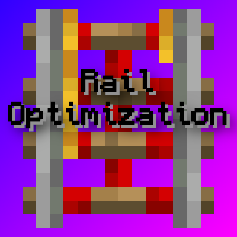

<div align="center">



# RailOptimization

[](https://github.com/EasterGhost/RailOptimization)
[](https://github.com/EasterGhost/RailOptimization)
[](https://modrinth.com/mod/railoptimization)

A simple mod that makes powered rails and activator rails update faster.

</div>

## About

RailOptimization replaces repeated vanilla rail searches and recursive updates with short-lived caches and batched propagation. It is intended for builds with long powered rail lines, especially rail systems where many rails are updated by the same redstone change.

## Features

- Faster powered rail and activator rail on/off updates.
- Optimized propagation for straight rails and ascending/descending rail chains.
- Runtime toggle command for debugging or compatibility checks.
- Configurable powered and activator rail signal range.
- GameTest coverage for straight rails, slopes, observer updates, BUD-sensitive behavior, and vanilla/optimized comparisons.

## Compatibility

Use the jar that matches your Minecraft version range:

| Jar | Loaders | Minecraft versions |
| --- | --- | --- |
| `railoptimization-<version>+mc1.20.1-<loader>.jar` | Fabric | 1.20-1.21.1 |
| `railoptimization-<version>+mc1.21.2-<loader>.jar` | Fabric | 1.21.2-1.21.4 |
| `railoptimization-<version>+mc1.21.5-<loader>.jar` | Fabric | 1.21.5-1.21.10 |
| `railoptimization-<version>+mc1.21.11-<loader>.jar` | Fabric | 1.21.11 |
| `railoptimization-<version>+mc26.1.2-<loader>.jar` | Fabric, NeoForge | 26.1-26.2 |

Use the jar for your mod loader. Fabric builds require Fabric Loader and Fabric API; NeoForge builds require NeoForge.

## Commands

| Command | Permission | Description |
| --- | --- | --- |
| `/railoptimization` | everyone | Shows the optimization state and current power limit |
| `/railoptimization on` | admin | Enables the optimized update path |
| `/railoptimization off` | admin | Disables the optimization and uses vanilla behavior |
| `/railoptimization powerLimit <value>` | admin | Sets the runtime rail power limit; values are clamped to 1-64 (default: 8) |
| `/railoptimization reload` | admin | Reloads the configuration file |

## Build

```bash
./gradlew :fabric:build
./gradlew :neoforge:build
```

Run `./gradlew build` to build both loaders. Fabric artifacts are written to `fabric/build/libs`; NeoForge artifacts are written to `neoforge/build/libs`.

Run the loader-specific GameTests with:

```bash
./gradlew :fabric:runGameTest
./gradlew :neoforge:runGameTestServer
```

## Notes

- This mod only changes powered rail and activator rail update logic.
- If you find a redstone contraption that behaves differently from vanilla, please open an issue with the Minecraft version, mod version, and a minimal reproduction.

## Links

- [Modrinth](https://modrinth.com/mod/railoptimization)
- [GitHub](https://github.com/EasterGhost/RailOptimization)
- [Issues](https://github.com/EasterGhost/RailOptimization/issues)

## Acknowledgements

RailOptimization began as a fork of [FxMorin's RailOptimization](https://github.com/FxMorin/RailOptimization). Thanks to FxMorin and the original contributors for their work. The current implementation has since been extensively rewritten.
